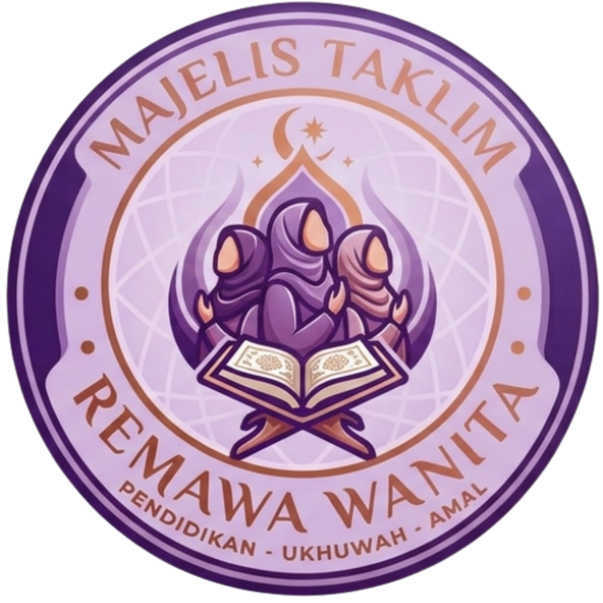
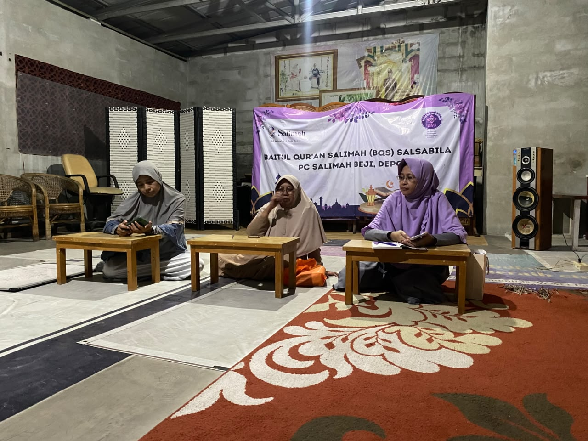

<div align="center">



# BQS Salsabilla Ruang Muslimah

**Sistem Manajemen Kajian & Pembelajaran untuk Santriwati**

Platform manajemen lengkap untuk kajian remaja muslimah dengan fitur absensi QR, penilaian hafalan, manajemen keuangan, dan monitoring kehadiran.

[](https://opensource.org/licenses/MIT)
[](https://www.typescriptlang.org/)
[](https://reactjs.org/)
[](https://tanstack.com/router)

</div>

---


## 🌟 Fitur Utama

### 👩‍🎓 Manajemen Santriwati
- Profil santriwati lengkap (pendidikan, RT, dll)
- Role-based access control (Admin, Guru, Santri)
- Manajemen akun santriwati

### 📚 Manajemen Materi & Jadwal
- Upload dan kelola materi kajian
- Jadwal kajian dengan detail lengkap
- Publikasi materi untuk santriwati

### 📝 Penilaian & Hafalan
- Input nilai kajian oleh guru
- Tracking hafalan Al-Qur'an
- Statistik performa santriwati
- Grade otomatis berdasarkan skor

### 📊 Absensi QR
- Sistem absensi dengan QR code
- Scan QR untuk kehadiran kajian
- Riwayat kehadiran lengkap
- Validasi real-time

### 💰 Manajemen Keuangan
- Pencatatan uang kas mingguan/bulanan
- Tracking infaq santriwati
- Verifikasi pembayaran oleh admin
- Laporan keuangan terintegrasi

### 🔐 Keamanan
- Autentikasi Supabase
- Role-based access control
- RLS (Row Level Security) policies
- Proteksi data sensitif

---

## 🛠️ Tech Stack

### Frontend 
- **React 19** - UI library
- **TypeScript 5.8** - Type safety
- **TanStack Router** - File-based routing
- **TanStack Query** - Data fetching & caching
- **Tailwind CSS 4** - Styling
- **Radix UI** - Component primitives
- **Lucide React** - Icons

### Backend
- **Supabase** - Database & Auth
- **PostgreSQL** - Database
- **Drizzle ORM** - Database queries
- **Vite** - Build tool & dev server

### Infrastruktur
- **GitHub** - Version control
- **Vercel** - Deployment (recommended)

---

## 📦 Installation

### Prerequisites
- Node.js 18+ 
- npm, bun, atau yarn
- Akun Supabase

### Setup Project

1. **Clone repository**
```bash
git clone https://github.com/Budibudian17/sakinahBQSSalsabilla.git
cd sakinahBQSSalsabilla
```

2. **Install dependencies**
```bash
bun install
# atau
npm install
```

3. **Setup environment variables**
```bash
cp .env.local.example .env.local
```

Edit `.env.local` dengan credentials Supabase Anda:
```env
VITE_SUPABASE_URL=your_supabase_url
VITE_SUPABASE_ANON_KEY=your_supabase_anon_key
```

4. **Setup database**
```bash
bun run db:push
# atau manual: run migrations in Supabase SQL Editor
```

5. **Run development server**
```bash
bun run dev
# atau
npm run dev
```

Buka [http://localhost:8080](http://localhost:8080) di browser.

---

## 🚀 Usage

### Akun Default

**Admin**
- Email: admin@sakinah.id
- Password: (setup saat pertama kali)

**Guru**
- Email: guru@sakinah.id
- Password: (setup saat pertama kali)

**Santri**
- Email: santri@sakinah.id
- Password: (setup saat pertama kali)

### Workflow

1. **Admin** setup jadwal dan materi kajian
2. **Guru** input nilai dan hafalan santriwati
3. **Santri** scan QR untuk absensi dan lihat nilai
4. **Semua role** dapat akses dashboard sesuai权限

---

## 📁 Project Structure

```
sakinahBQSSalsabilla/
├── public/                 # Static assets
│   ├── logopengajianbaru.webp
│   └── ...
├── src/
│   ├── components/         # Reusable components
│   │   ├── admin-shell.tsx
│   │   ├── teacher-shell.tsx
│   │   ├── sakinah-shell.tsx
│   │   └── ui/             # UI components
│   ├── hooks/              # Custom hooks
│   ├── integrations/       # Supabase integration
│   ├── lib/                # Utilities
│   ├── routes/             # Route pages
│   │   ├── admin-*/        # Admin pages
│   │   ├── guru-*/         # Guru pages
│   │   ├── index.tsx       # Dashboard santri
│   │   └── ...
│   ├── styles.css          # Global styles
│   └── router.tsx          # Router config
├── drizzle/                # Database migrations
├── supabase/               # Supabase config
└── package.json
```

---

## 🎨 Fitur per Role

### 👩‍💼 Admin
- Manajemen santriwati (CRUD)
- Manajemen jadwal kajian
- Upload materi kajian
- Verifikasi pembayaran
- Monitoring absensi
- Inspeksi data

### 👩‍🏫 Guru
- Input nilai kajian
- Input hafalan santriwati
- Scan QR absensi
- Lihat statistik kelas
- Manajemen materi

### 👩‍🎓 Santri
- Dashboard personal
- Lihat jadwal kajian
- Scan QR absensi
- Lihat nilai & hafalan
- Akses materi kajian
- Catat keuangan

---

## 🔧 Configuration

### Database Schema

Tables utama:
- `profiles` - Data profil santriwati
- `user_roles` - Role assignment
- `schedules` - Jadwal kajian
- `materi` - Materi kajian
- `hafalan` - Data hafalan
- `nilai` - Data nilai
- `keuangan` - Transaksi keuangan
- `qr_codes` - QR codes untuk absensi
- `qr_attendance` - Data absensi

### Environment Variables

| Variable | Description | Required |
|----------|-------------|-----------|
| `VITE_SUPABASE_URL` | Supabase project URL | Yes |
| `VITE_SUPABASE_ANON_KEY` | Supabase anon key | Yes |

---

## 📱 Screenshots

<div align="center">
  
</div>

---

## 🤝 Contributing

Contributions are welcome! Please feel free to submit a Pull Request.

1. Fork the repository
2. Create your feature branch (`git checkout -b feature/AmazingFeature`)
3. Commit your changes (`git commit -m 'Add some AmazingFeature'`)
4. Push to the branch (`git push origin feature/AmazingFeature`)
5. Open a Pull Request

---

## 📄 License

This project is licensed under the MIT License - see the [LICENSE](LICENSE) file for details.

---

## 📞 Contact

**BQS Salsabilla Ruang Muslimah**

- Project URL: [https://github.com/Budibudian17/sakinahBQSSalsabilla](https://github.com/Budibudian17/sakinahBQSSalsabilla)
- Issues: [https://github.com/Budibudian17/sakinahBQSSalsabilla/issues](https://github.com/Budibudian17/sakinahBQSSalsabilla/issues)

---

<div align="center">

Made with ❤️ by BQS Salsabilla Ruang Muslimah

</div>
